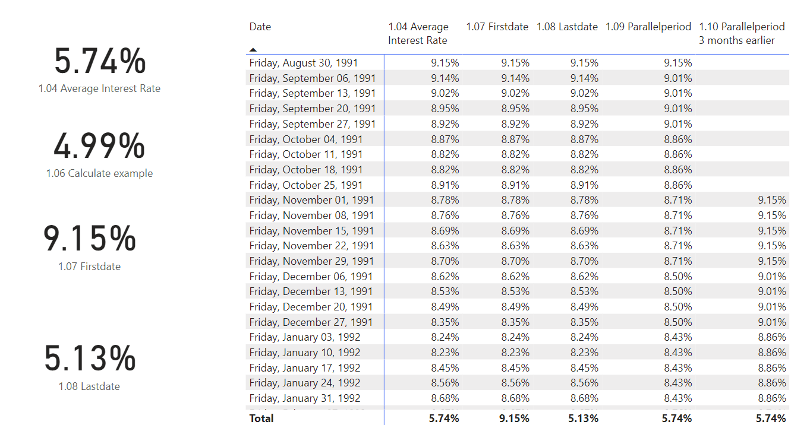

# Loan Model Power BI Data Model

### Overview  
This project demonstrates how to create a dynamic Power BI data model to analyze mortgage loans based on Federal Reserve Economic Data (FRED). The model calculates key loan metrics for both **15-year** and **30-year** fixed mortgage rates, utilizing **DAX** for efficient loan calculations and visualizations.

### Project Overview: 
🧩 Creating a Power BI data model using DAX calculations to build a loan model based on mortgage rates.
### Data Sources:
🔍 The model uses interest rates from the Federal Reserve Economic Data (FRED), including 30-year and 15-year fixed mortgage rates.

### Key Features
- **Interest Rate Data**: Imports mortgage rates from FRED (15-year & 30-year fixed).
  
  
- **Loan Calculations**: Computes monthly rates, payments, balances, interest, and principal payments.
  
  
- **Dynamic Visualization**: Utilizes Power BI's capabilities for interactive charts and reports.
  
  
  
### Tools & Technologies
- **Power BI**: Leverages Power BI’s strong capabilities from Microsoft products such as Excel and Access. It enables comprehensive data analysis and visualization, making it shareable and scalable.
- **VertiPaq Engine**: Power BI’s VertiPaq engine allows faster calculations and visualizations by storing data in memory when using the import connection type. Measures are more efficient than calculated columns in large data models.
- **DAX**: Used for performing necessary loan calculations and dynamic measures.

## Usage
- Interact with the dynamic visuals to analyze loan metrics and payments.
- Modify interest rates or parameters to simulate different loan scenarios.

**Closing Thoughts**

💡 This project helped me to enhanced my skills and understanding on how to leverage Power BI and DAX for real-world financial modeling.
