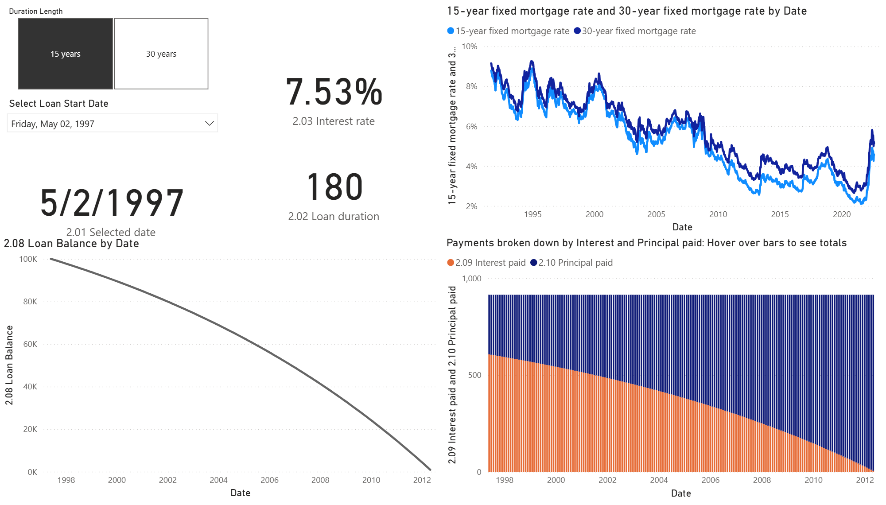

# Loan Model Power BI Data Model

## Overview  
This project demonstrates how to create a dynamic Power BI data model to analyze mortgage loans based on Federal Reserve Economic Data (FRED). The model calculates key loan metrics for both **15-year** and **30-year** fixed mortgage rates, utilizing **DAX** for efficient loan calculations and visualizations.

## Key Features
- **Interest Rate Data**: Imports mortgage rates from FRED (15-year & 30-year fixed).
- **Loan Calculations**: Computes monthly rates, payments, balances, interest, and principal payments.
- **Dynamic Visualization**: Utilizes Power BI's capabilities for interactive charts and reports.

## Tools & Technologies
- **Power BI**: Leverages Power BI’s strong capabilities from Microsoft products such as Excel and Access. It enables comprehensive data analysis and visualization, making it shareable and scalable.
- **VertiPaq Engine**: Power BI’s VertiPaq engine allows faster calculations and visualizations by storing data in memory when using the import connection type. Measures are more efficient than calculated columns in large data models.
- **DAX**: Used for performing necessary loan calculations and dynamic measures.

## Project Size, Urgency, and Long-Term Goals  
The data tools chosen for this project were based on factors like scalability, efficiency, and the goal of sharing insights across business units. Power BI offers robust tools that work seamlessly with large datasets, making it ideal for long-term use and larger scale data strategies.

## Installation  
1. Clone this repository.
2. Open the Power BI Desktop file (`.pbix`).
3. Connect the model to the **FRED API** or use **CSV** data files.

## Usage
- Interact with the dynamic visuals to analyze loan metrics and payments.
- Modify interest rates or parameters to simulate different loan scenarios.

